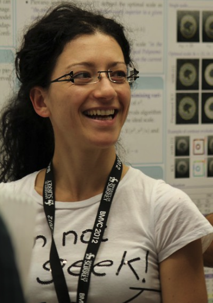
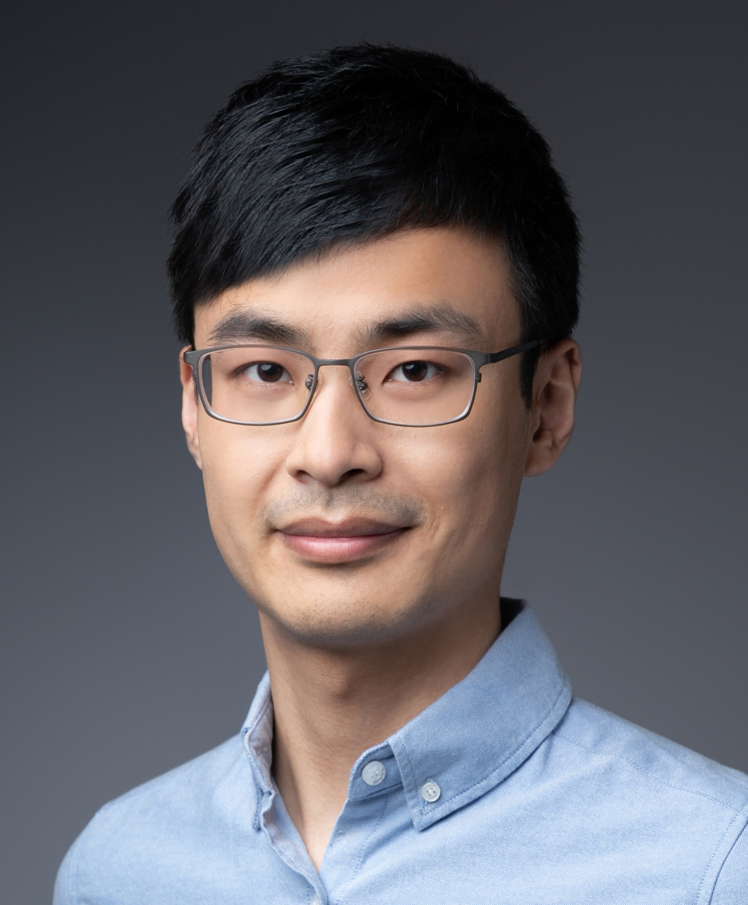
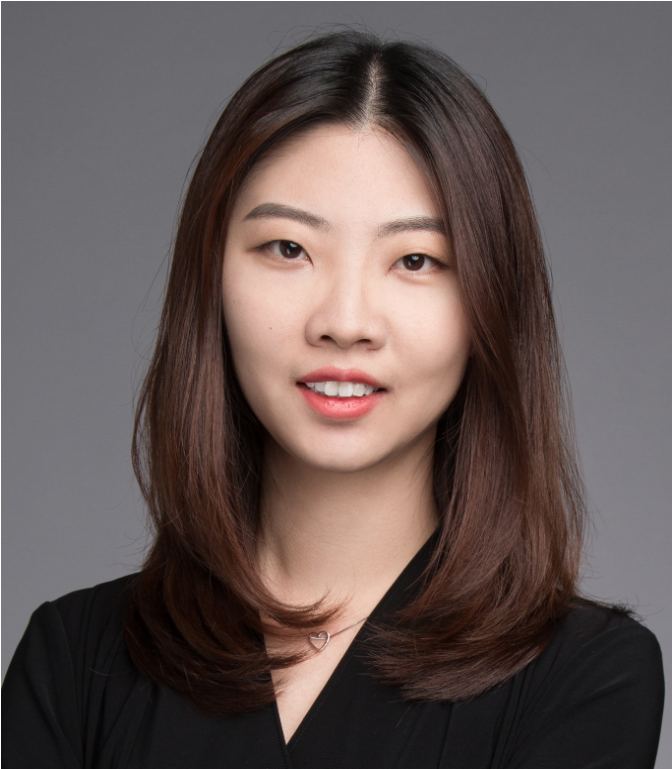

---

## Invited Speakers

<!---   

[David Lopez-Paz](http://lopezpaz.org/), Research Scientist at Meta AI Research

-->

  

[Amos Storkey](https://homepages.inf.ed.ac.uk/amos/), Professor in the School of Informatics, University of Edinburgh

  

[Tatiana Tommasi](http://www.tatianatommasi.com), Associate Professor at the Department of Control and Computer Engineering of Politecnico di Torino and Affiliated Researcher at the Italian Institute of Technology.

  

[Lequan Yu](https://yulequan.github.io), assistant professor at The University of Hong Kong. 

## Panel

  

[Zachary Lipton](https://www.zacharylipton.com), Assistant Professor of Machine Learning and Operations Research, Carnegie Mellon University 

  

[Qi Dou](https://www.cse.cuhk.edu.hk/~qdou/), Assistant Professor, Department of Computer Science and Engineering, The Chinese University of Hong Kong

  

[Boqing Gong](http://boqinggong.info), Research Scientist, Google

